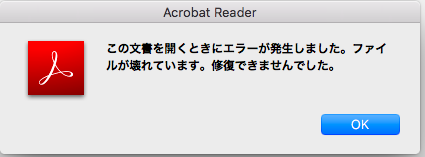

# MEEPWN 2018 #

hello. I'm yotti.<br>

では解説してきたいと思います.<br>
今回解いた問題は,"White Snow Black Shadow"です.<br>
他は難しくて私には解けませんでた^^;

まずファイルを解凍すると,evidence.jpgというファイルが出てきます.<br>
これを見てみると,名探偵コナンの画像ファイルでした笑.<br>


なんだか少し親近感が湧きつつ,解析を進めていきます<br>
まず画像にファイルが埋め込まれていないか調べてみます.<br>

```
net40-dhcp179:file yotti$ binwalk -e evidence.jpg 

DECIMAL       HEXADECIMAL     DESCRIPTION
--------------------------------------------------------------------------------
0             0x0             JPEG image data, JFIF standard 1.01
30            0x1E            TIFF image data, big-endian, offset of first image directory: 8
217428        0x35154         End of Zip archive
```

なにやらzipファイルが含まれているっぽいです<br>
またhexdumpで調べてみると,pdfファイルが隠されているっぽいです<br>

```
    :
    :
00035110  4c 01 00 0b 00 24 00 00  00 00 00 00 00 20 00 00  |L....$....... ..|
00035120  00 00 00 00 00 6d 65 73  73 61 67 65 2e 70 64 66  |.....message.pdf|
00035130  0a 00 20 00 00 00 00 00  01 00 18 00 aa 23 e6 a5  |.. ..........#..|
00035140  5c 13 d4 01 8e b9 7b 08  37 14 d4 01 4f 7c 0c 08  |\.....{.7...O|..|
00035150  37 14 d4 01 50 4b 05 06  00 00 00 00 01 00 01 00  |7...PK..........|
00035160  5d 00 00 00 9d 31 01 00  00 00                    |]....1....|
```

```
net40-dhcp179:file yotti$ unzip -l evidence.jpg 
Archive:  evidence.jpg
warning [evidence.jpg]:  139098 extra bytes at beginning or within zipfile
  (attempting to process anyway)
  Length     Date   Time    Name
 --------    ----   ----    ----
    85172  07-04-18 13:02   message.pdf
 --------                   -------
    85172                   1 file

```

binwalk,unzipでも抽出ができないので,zipファイルのヘッダ情報が破損している疑惑があるため調べてみる<br>
調べてみるとPKという文字列が幾つかevidence.jpgに出現しているが,これはzipヘッダーのシグネチャに含まれている文字列ということが判明<br>

```
4.3.7  Local file header:

      local file header signature     4 bytes  (0x04034b50)
      version needed to extract       2 bytes
      general purpose bit flag        2 bytes
      compression method              2 bytes
      last mod file time              2 bytes
      last mod file date              2 bytes
      crc-32                          4 bytes
      compressed size                 4 bytes
      uncompressed size               4 bytes
      file name length                2 bytes
      extra field length              2 bytes

      file name (variable size)
      extra field (variable size)

```

色々調べてみるとlocal file header signatureは0x04034b50(054b0304)で表されているということが判明.<br>
早速evidence.jpgファイルをバイナリエディタで調べてみると,054b0506となっていたので書き換えてみる<br>

```
修正前
00021f50  6d cb 73 4f a0 b9 75 b9  ff d9 50 4b 05 06 14 00  |m.sO..u...PK....|
00021f60  00 00 09 00 5b 68 e4 4c  2e db f5 54 74 31 01 00  |....[h.L...Tt1..|
```
```
修正後
00021f50  6d cb 73 4f a0 b9 75 b9  ff d9 50 4b 03 04 14 00  |m.sO..u...PK....|
00021f60  00 00 09 00 5b 68 e4 4c  2e db f5 54 74 31 01 00  |....[h.L...Tt1..|
```


書き換えた後binwalkで抽出してみると....

```
net40-dhcp179:file yotti$ binwalk -e evidence.jpg 

DECIMAL       HEXADECIMAL     DESCRIPTION
--------------------------------------------------------------------------------
0             0x0             JPEG image data, JFIF standard 1.01
30            0x1E            TIFF image data, big-endian, offset of first image directory: 8
139098        0x21F5A         Zip archive data, at least v2.0 to extract, compressed size: 78196, uncompressed size: 85172, name: message.pdf
217428        0x35154         End of Zip archive


```

上手くいきました！！<br>
message.pdfを開いてみましょう<br>




壊れていますね^^; 　一緒に出てきたzipファイルを見てみましょう<br>

```
net40-dhcp179:_evidence.jpg.extracted yotti$ unzip 21F5A.zip 
Archive:  21F5A.zip
replace message.pdf? [y]es, [n]o, [A]ll, [N]one, [r]ename: r
new name: test
  inflating: test                     bad CRC 0e5b4440  (should be 54f5db2e)
```

これも壊れて解凍ができませんね__;<br>
CRCの0e5b4440がbadと言っていますね、色々調べてみましょう<br>
おそらくbinwalkで抽出する前にこのcrcの部分を書き換えないとダメなようです<br>


```
4.3.7  Local file header:

      local file header signature     4 bytes  (0x04034b50)
      version needed to extract       2 bytes
      general purpose bit flag        2 bytes
      compression method              2 bytes
      last mod file time              2 bytes
      last mod file date              2 bytes
      crc-32                          4 bytes
      compressed size                 4 bytes
      uncompressed size               4 bytes
      file name length                2 bytes
      extra field length              2 bytes

      file name (variable size)
      extra field (variable size)

```

```
修正前
00021f50  6d cb 73 4f a0 b9 75 b9  ff d9 50 4b 03 04 14 00  |m.sO..u...PK....|
00021f60  00 00 09 00 5b 68 e4 4c  2e db f5 54 74 31 01 00  |....[h.L...Tt1..|
```

このPKから10byte目のうぶんを書き換えます。crc-32の部分を書き換えます。<br>
01-09まで試した結果,08にしたら解凍できるようになりました!<br>

```
修正後
00021f50  6d cb 73 4f a0 b9 75 b9  ff d9 50 4b 03 04 14 00  |m.sO..u...PK....|
00021f60  00 00 08 00 5b 68 e4 4c  2e db f5 54 74 31 01 00  |....[h.L...Tt1..|
```

これでpdfが開けるようになりました<br>
pdfを開いても特に変わった様子はなさそうですね...<br>

とりあえずpdfをtxtに変換してみます。<br>

```
net40-dhcp179:_evidence.jpg-0.extracted yotti$ cat message.txt
“When you have eliminated the impossible, whatever remains, however improbable,
must be the truth.”
– Sir Arthur Conan Doyle
What does that mean?
To me, this is all about logic. If you start with everything you can think of, and then eliminate
those that are impossible, you are well on your way to a solution.
That’s the first stage of solving any mystery, whether it’s a murder mystery in a book (or TV,
or movie, or…) or something you expected to work, but didn’t. You have to eliminate all the
Mee

things that it couldn’t possibly be, or you will have too many distractions.
Once we clear out all the distractions, we can focus on what remains. Sometimes what is
left is easy to believe, other times it can seem highly improbable. However, with the
impossible eliminated, what remains are the only possible solutions. And one of them must
Pwn

CTF

be the truth.
Why is clearing out the impossible solutions important?
Sometimes, it can be hard to solve a challenging situation even under the best of
{T3

circumstances. A problem with lots of shiny things to look at can be distracting, and waste a
xt_

great deal of our time.
While some impossibilities might be obvious, sometimes we can be sucked in by an idea
Und

that intrigues us, despite being impossible. Other times, it is only in close examination that
3r_

the impossibility is revealed.
However, once we clear the clutter by removing all that is impossible, we are left with an
easier solution. Gone are the impossibilities, both obvious and subtle. What is left can be
t3X

gone over more quickly, and evaluated for probability or even likelihood.
This may be an iterative process, starting with the really obvious impossibilities, and then
moving to the shiny distractions. Finally, as we work our way through the last of the options,
t!!!!}

we may still find ourselves weeding out additional impossibilities.
```

このように改行でflagがでてきました！！！！

'''MEEPWN={T3xt_Und3r_t3Xt!!!!}'''

結構難しくて時間がかかってしまいました。。。