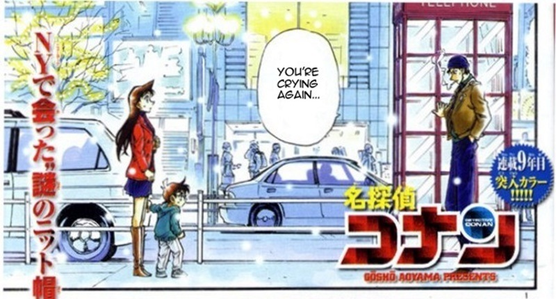

# MEEPWN 2018 #

hello. I'm yotti.<br>

では解説してきたいと思います.<br>
今回解いた問題は,"White Snow Black Shadow"です.<br>
他は難しくて私には解けませんでた^^;

まずファイルを解凍すると,evidence.jpgというファイルが出てきます.<br>
これを見てみると,名探偵コナンの画像ファイルでした笑.<br>



なんだか少し親近感が湧きつつ,解析を進めていきます<br>
まず画像にファイルが埋め込まれていないか調べてみます.<br>

```
net40-dhcp179:file yotti$ binwalk -e evidence.jpg 

DECIMAL       HEXADECIMAL     DESCRIPTION
--------------------------------------------------------------------------------
0             0x0             JPEG image data, JFIF standard 1.01
30            0x1E            TIFF image data, big-endian, offset of first image directory: 8
217428        0x35154         End of Zip archive
```

なにやらzipファイルが含まれているっぽいです<br>
またhexdumpで調べてみると,pdfファイルが隠されているっぽいです<br>

```
    :
    :
00035110  4c 01 00 0b 00 24 00 00  00 00 00 00 00 20 00 00  |L....$....... ..|
00035120  00 00 00 00 00 6d 65 73  73 61 67 65 2e 70 64 66  |.....message.pdf|
00035130  0a 00 20 00 00 00 00 00  01 00 18 00 aa 23 e6 a5  |.. ..........#..|
00035140  5c 13 d4 01 8e b9 7b 08  37 14 d4 01 4f 7c 0c 08  |\.....{.7...O|..|
00035150  37 14 d4 01 50 4b 05 06  00 00 00 00 01 00 01 00  |7...PK..........|
00035160  5d 00 00 00 9d 31 01 00  00 00                    |]....1....|
```

```
net40-dhcp179:file yotti$ unzip -l evidence.jpg 
Archive:  evidence.jpg
warning [evidence.jpg]:  139098 extra bytes at beginning or within zipfile
  (attempting to process anyway)
  Length     Date   Time    Name
 --------    ----   ----    ----
    85172  07-04-18 13:02   message.pdf
 --------                   -------
    85172                   1 file

```

binwalk,unzipでも抽出ができないので,zipファイルのヘッダ情報が破損している疑惑があるため調べてみる<br>
調べてみるとPKという文字列が幾つかevidence.jpgに出現しているが,これはzipヘッダーのシグネチャに含まれている文字列ということが判明<br>
色々調べてみると,,,,

```
ファイルの外枠部分の情報を格納します。Central directory header との重複がかなりあります。
Size					      フィールド       値
4					      local file header signature
Local file header であることを示す固定値
$04034B50 = $50, $4B, $03, $04
2	  version needed to extract
展開に必要なZIPのバージョン補足
10 (ver.1.0) ⇒無圧縮ファイル
20 (ver.2.0) ⇒フォルダ、デフレート、パスワード保護
45 (ver.4.5) ⇒ZIP64
2  general purpose bit flag
オプションフラグ
ビットフラグ
%0000000000000001 (パスワード保護)
%0000000000001000 (Data descriptor を使用)
%0000100000000000 (ファイル名やコメントが UTF-8文字)
2		  compression method
ファイル圧縮に用いたアルゴリズム補足
0 (無圧縮ファイル)
8 (デフレート形式)
2 last mod file time
タイムスタンプ(時刻)
ビット割り当て
%1111100000000000 = 0～23 [時]
%0000011111100000 = 0～59 [分]
%0000000000011111 = 0～29 [×2秒] ⇒1で2秒分を表す
2		  last mod file date
タイムスタンプ(日付)
ビット割り当て
%1111111000000000 = 0～   [＋1980年] ⇒西暦1980年からの経過年
%0000000111100000 = 1～12 [月]
%0000000000011111 = 1～31 [日]
4		  crc-32
ファイルのデータから算出した CRC-32 の値補足
n (CRC-32)
0 (Data descriptor 使用の場合)
4 compressed size
圧縮後のデータ量、File data のサイズ
無圧縮なら uncompressed size フィールドと同値
n [byte]
0 [byte]  (データ無し) ⇒フォルダ、空ファイルなど
0         (Data descriptor 使用の場合)
$FFFFFFFF (ZIP64)
4	  uncompressed size
圧縮前のデータ量、つまりファイルサイズ
n [byte]
0 [byte]  (データ無し) ⇒フォルダ、空ファイルなど
0         (Data descriptor 使用の場合)
$FFFFFFFF (ZIP64)
2	  file name length
file name フィールドのサイズ
n [byte]
0 [byte] (名前なし) ⇒標準入力からの流入
2 extra field length
extra field フィールドのサイズ
n [byte]
0 [byte] (extra field を使用しない)
s file name
ファイル名を格納する領域
"ファイル名"
※ドライブ・デバイスレター・先頭のスラッシュは無し
※フォルダ区切りは普通のスラッシュ"/"
s	extra field
拡張データを格納する領域補足
任意データ

```