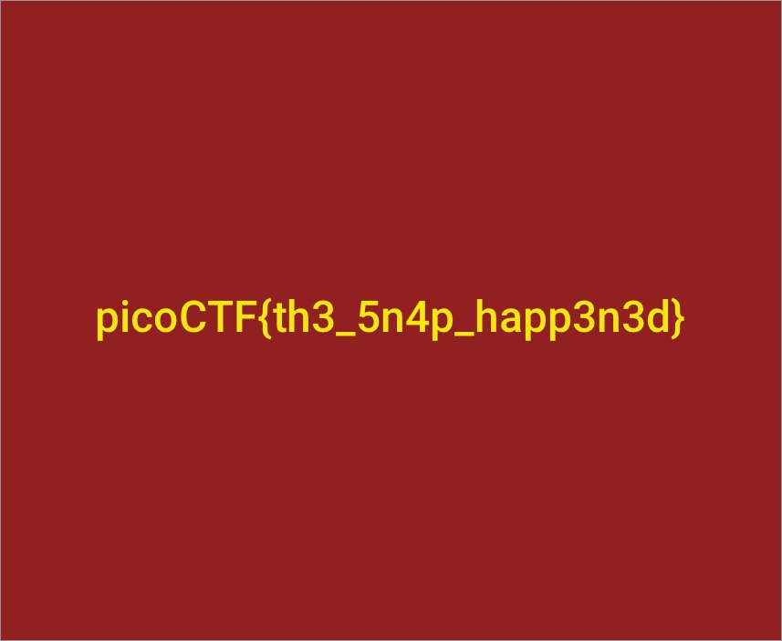

## PicoCTF 2018 ##
## Introduction ##

hello! I'm yotti.<br>
今回はpicoCTFの問題を解いてみました.やった感じ,ビギナーズ向けのctfでした<br>
writeup書くほどでもないと思いましたが, 一応書き残しておきます-<br>
ctf初心者とか,最近やったばっかりとかの人にはかなり良いと思います！<br>
それ問題を解いたのに,"you or one of your teammates have already tried this solutions"<br>
となり解いたことにならなかった問題が多々あり困ってます(現在進行形)<br>
I don't know what is this problem for us, please teach me to solve its problem!!<br>

URL:https://2018game.picoctf.com/problems

前半はコマンドの使用方法とかで簡単なので飛ばします.<br>
pint100くらいから解説します(それでも簡単だが....)


## HEEEEEEERE'S Johnny! - Points: 100 - ##

問題文は以下のとおり

```
Okay, so we found some important looking files on a linux computer. 
Maybe they can be used to get a password to the process. 
Connect with nc 2018shell3.picoctf.com 42165. Files can be found here: passwd shadow.
```

これはjohn the ripperを使う問題っぽいですね、passwdとshadowファイルが与えられています.
では早速解いていきましょう！！

とりあえず nc 2018shell3.picoctf.com 42165に接続してみます。

```
net40-dhcp179:file yotti$ nc 2018shell3.picoctf.com 42165
Username: test
Password: test  
Failed Login!
```

解析したユーザー名とアドレスを入力するようですね.早速johnでpassファイルを解析しますー。

```
net40-dhcp179:file yotti$ cat shadow 
root:$6$HRMJoyGA$26FIgg6CU0bGUOfqFB0Qo9AE2LRZxG8N3H.3BK8t49wGlYbkFbxVFtGOZqVIq3qQ6k0oetDbn2aVzdhuVQ6US.:17770:0:99999:7:::
net40-dhcp179:file yotti$ cat passwd 
root:x:0:0:root:/root:/bin/bashnet40-dhcp179:file yotti$ 
```

unshadowを使ってshadowファイルとpasswdファイルをjohnに解析できる形式にします。

```
net40-dhcp179:file yotti$ /usr/local/Cellar/john/1.8.0/share/john/unshadow  passwd shadow > testfile
net40-dhcp179:file yotti$ /usr/local/Cellar/john/1.8.0/share/john/john  --wordlist=/usr/local/Cellar/john/1.8.0/share/john/password.lst --users=root ./testfile 
root:kissme:0:0:root:/root:/bin/bash
1 password hash cracked, 0 left
```

はい解析できましたね。<br>
user:root<br>
pass:kissme<br>

loginしてみましょー

```
net40-dhcp179:file yotti$   nc 2018shell2.picoctf.com 5221
Username: root
Password: kissme
picoCTF{J0hn_1$_R1pp3d_289677b5}
```

出ましたね.``picoCTF{J0hn_1$_R1pp3d_289677b5}``
今後も色々使うと思うのでもっとjohnの使い方についてマスターしたいと思います...


## strings - Points: 100 ##
question:
```
Can you find the flag in this file without actually running it? 
You can also find the file in /problems/strings_4_40d221755b4a0b134c2a7a2e825ef95f on the shell server.
```
これは,stringsとgrepを使えば解けます
```
net40-dhcp48:file yotti$ strings strings | grep pico
picoCTF{sTrIngS_sAVeS_Time_d3ffa29c}
```

``picoCTF{sTrIngS_sAVeS_Time_d3ffa29c}``

## pipe - Points: 110 ##
question:
```
During your adventure, you will likely encounter a situation where you need to process data that you receive over the network rather than through a file. Can you find a way to save the output from this program and search for the flag? Connect with 2018shell3.picoctf.com 2015.
```
grepとnc使えば解けます

```
net40-dhcp48:file yotti$ nc 2018shell3.picoctf.com 2015  >> test
test.txt   test.txt~  testfile   
net40-dhcp48:file yotti$ nc 2018shell3.picoctf.com 2015  >> output
net40-dhcp48:file yotti$ cat output | grep pico
picoCTF{almost_like_mario_8861411c}
```
``picoCTF{almost_like_mario_8861411c}``

## Inspect Me - Points: 125 ##

question:
```
Inpect this code! http://2018shell3.picoctf.com:56252 (link)
```

web問題は苦手ですが,これは簡単なのでいけますw

sourceを見れば, flagが書いてあります。<br>
index.html, css,　my.jsにそれぞれ書いてありました

index.html
```
       :                      :
  JS (JavaScript)
  </p>
  <!-- I learned HTML! Here's part 1/3 of the flag: picoCTF{ur_4_real_1nspe -->
```

mycss.css
```
       :                :
#tabintro { background-color: #ccc; }
#tababout { background-color: #ccc; }

/* I learned CSS! Here's part 2/3 of the flag: ct0r_g4dget_098df0d0} */
```

myjs.js
```
          :        :
window.onload = function() {
    openTab('tabintro', this, '#222');
}

/* I learned JavaScript! Here's part 3/3 of the flag:  */
```

合わせると, ``picoCTF{ur_4_real_1nspect0r_g4dget_098df0d0}``

## grep 2 - Points: 125 ##

question:
```
This one is a little bit harder. Can you find the flag in /problems/grep-2_4_06c2058761f24267033e7ca6ff9d9144/files on the shell server? Remember, grep is your friend.
``` 

これもgrep使う問題です.
オプション-rを使ってフォルダ探索するだけです

```
yocchi@pico-2018-shell-3:~$ grep -r "pico" /problems/grep-2_4_06c2058761f24267033e7ca6ff9d9144/files
/problems/grep-2_4_06c2058761f24267033e7ca6ff9d9144/files/files4/file1:picoCTF{grep_r_and_you_will_find_036bbb
25}  
```

``picoCTF{grep_r_and_you_will_find_036bbb25}``

## Aca-Shell-A - Points: 150 ##
question:

```
It's never a bad idea to brush up on those linux skills or even learn some new ones before you set off on this adventure! Connect with nc 2018shell3.picoctf.com 42334.
```

これは普通にncでサーバーに接続して, 言われた通りにしていくだけです.<br>
めちゃ簡単ですが,一定時間経つとサーバーから弾かれるのでめんどくさいですw<br>

```
net40-dhcp48:file yotti$ nc 2018shell3.picoctf.com 42334
Sweet! We have gotten access into the system but we aren't root.
It's some sort of restricted shell! I can't see what you are typing
but I can see your output. I'll be here to help you along.
If you need help, type "echo 'Help Me!'" and I'll see what I can do
There is not much time left!
~/$ ls
blackmail
executables
passwords
photos
secret
~/$ cd secret
Now we are cookin'! Take a look around there and tell me what you find!
~/secret$ rm intel*
~/secret$ ls
profile_ahqueith5aekongieP4ahzugi
profile_ahShaighaxahMooshuP1johgo
profile_aik4hah9ilie9foru0Phoaph0
profile_AipieG5Ua9aewei5ieSoh7aph
profile_bah9Ech9oa4xaicohphahfaiG
profile_ie7sheiP7su2At2ahw6iRikoe
profile_of0Nee4laith8odaeLachoonu
profile_poh9eij4Choophaweiwev6eev
profile_poo3ipohGohThi9Cohverai7e
profile_Xei2uu5suwangohceedaifohs
Sabatoge them! Get rid of all their intel files!
~/secret$ rm intel*
rm: cannot remove 'intel*': No such file or directory
Nice! Once they are all gone, I think I can drop you a file of an exploit!
Just type "echo 'Drop it in!' " and we can give it a whirl!
~/secret$ echo 'Drop it in!'
Drop it in!
I placed a file in the executables folder as it looks like the only place we can execute from!
Run the script I wrote to have a little more impact on the system!
~/secret$ cd ..
~/$ ls
blackmail
executables
passwords
photos
secret
~/$ cd executables
~/executables$ ls
dontLookHere
~/executables$ ./dontLookHere
 6a4a 609f f090 2d66 ce0e 595b de21 81b9 b19f 4c4d 8fcc b127 9bb5 a70a f4e5 a6bc 82e3 9fdd 31e1 44be 0d95 649c 6046 0b46 fc6a
 5270 df10 2a8b f482 fd55 83ea a4e9 53a6 ef37 9496 be9c aef1 2565 8f0d 748e e0d2 7ea9 664c 2872 ab1b 0c09 6baf 220d fd1c 28db
 e3e2 0be8 6a94 0602 48e4 6981 1e2b 0f8c c748 5fb7 a80b 2b91 3559 5700 1318 d22e 4662 558f 886e 59be 5b8c f50a 98ad ba8a adc7
 b7e0 eb42 0988 23e9 4a27 9552 f25f 30de 38f7 d738 2f94 20ea bbf4 34ce e313 d18a 0d67 ea90 cb9c d5c1 7561 c606 efe9 cf0e 824b
 0aa7 5bf6 bfaf 0d3e b98c 78de 63f2 5e65 c893 94e2 0dbd f082 ad5e 0b52 6073 f9b9 a71a 3209 0a79 a18d f6b6 9889 f836 fae6 6023
 8204 e1e1 d6f6 b067 67d2 0aa4 af81 2b3c b857 19e7 4b74 d0dc 133a 96b4 0575 1715 a019 6466 f9b9 c107 41b4 d71c 04ea f0c6 f5f0
 c05c c164 0f08 1bdf d9c8 5264 ddc3 cd61 389d ec65 ffe3 8924 9d4d f82a a8ac 5867 7dd2 9f76 cf4d 27e1 e7fd 89c4 cf4d b667 b167
 2528 dbc2 5a16 f29a db54 e0d9 6df9 eb92 4928 15e1 2af8 6f9f 3045 396e 2b16 a10e c086 98ec d681 55df 807f 6833 9485 6fbc 11d0
 9bd5 daeb c220 1254 ece2 5528 9676 633b e9d7 c8b8 38a9 bf9a 9439 1008 df8e a23c 2fb6 bab7 77a2 f83c 66e8 93e3 d7e9 0854 50e9
 4aaa fb35 6634 7845 102e 517f 59ce 5e4d d793 2eb8 97ab cf8d df98 d26c 47ac 1967 f848 2ed2 f5ce c5e0 39da 7a0d 84a2 5d33 da88
 d191 03cd 425c f111 2e16 7022 7256 84a5 236a c2a6 86d4 9125 fce2 2bee 5906 7e68 5510 4b8e 798b 1151 c52f 3e4f d128 984f f49c
 ac59 9210 c403 d4e0 2cd4 1d19 ca39 bbe6 42c5 04a6 e16b f0bc 1fbf 4cab 0abe 63ac 64c6 aa99 fe18 0437 8023 e0b5 0ae5 716f 3b38
 63c9 b6e7 3483 6e95 f197 7874 c193 a7de 7c2d d464 f58f 872d 74ac 5a64 a0d8 c8e5 6dcc a1dc 348c 29d0 77b6 7a33 9b15 3afc ef59
 c93d 0c90 9fe5 ccfc f61c d8d2 c7fb a688 61d4 1ff7 a228 adf0 392c fd30 4238 a241 c143 f6c1 93b6 d759 7e6b 97fb eaf2 ee86 20bf
 1491 4085 7206 2ca6 11e3 12f6 b6f7 df89 bc23 5812 e54f e279 74ae 9fca 29ec 4319 a74a 3f1e 8783 ff36 b528 705e 0235 9ff7 ff11
 21bf dbbf ad72 9567 9a8c 9f63 9131 4443 0008 ae9a 5b31 5283 85a6 665e 8ee5 dfa2 f3da 6faa 7db5 8449 9d3e 208c c4c1 425f 7eae
 2ee1 46b9 253e 0011 ef5f 6fbf c7ad 944a cd11 da08 dbba 7fc7 4839 36d9 8020 50e4 f05c 9497 99aa e208 880a 99fd 5680 eab1 e8d4
 8772 885b f6a1 64ab 8af7 a524 be98 0280 90c4 8791 6c68 8629 1f7d fd9b d5f0 9ee3 9334 0b76 c4a5 8303 e03b 4592 8c16 0508 c40d
 ccf4 16d9 c97b b2bf 715d 0dca 39d1 fb19 f4a9 1e73 c329 f43d ac4a c4e7 6baf 3d18 46ef d7b1 a462 7cd5 57fe c820 8384 bb58 b506
 8190 cd88 8e8e 2e9d c792 9656 c25f 7edf 461a 6892 f0f9 079c 965b 88ff 3fa7 e3ce 6097 d752 71f7 a153 8f28 ca71 b7e1 a510 5e7c
 262c 8c43 33ac b386 0d94 a548 8652 b421 e1c7 46ce a432 9824 ccef 826f ce67 2a53 6daa 36fe de03 fdb8 bd91 916d d5e9 6792 e921
 6c6d e8a4 7a06 e79e 4786 9560 4068 d71b e343 976a d716 d893 6944 9ac8 3f0f 7c19 ae33 b3e3 60a0 9323 1dd0 6e2b 89a6 c6c0 8375
 0477 2546 a2b5 60ba 72c0 b211 e941 60b0 88a3 3222 cfeb fd4c 02f7 f0d3 1e4b 0606 3b2f 5808 7fdf e38d 408b 69ee 012d 017b 42d3
 e4da fb4a 884d 21e4 367a 0063 bfd1 bc93 6dd8 f196 067e d43a 82cf 4925 790e c30b f78e b8b5 a252 952a b466 86eb a1a1 91e9 b76e
 b3bd e70c 2922 562b deef 4160 3794 4fdf de76 ceda 8595 3163 b7eb e59f 17a2 5a7f 4131 514c ee28 c3c6 c609 21fd 4ef8 d3f8 3646
 15e7 6a00 a6e6 e001 fe60 4f19 8436 0175 ffcf 5643 61c6 18c0 789b 8f46 3595 127b 0bc7 09fd 56f8 4758 f92b 9392 591a f0b9 684c
 c404 f4f2 29f3 6247 d69d 56c6 14fc 380c 0bc2 5190 17d7 3a67 cf68 0113 b783 c1a1 661a 681a e9e1 8fdd e309 4edd e7c4 d2b0 faca
 bc5d 1b08 9f7a 1260 6c46 cdc1 3361 2f3d 247d f8e2 aab8 768b 6f25 2e93 4abf 047f d6de a09e 4897 d959 0f0c 4238 5945 6dce d2a1
 51d8 4b7d a561 19f3 7d18 970d 0745 e2b6 9cb3 0362 4543 e406 952e f6cf 4bc3 d5ed 55fc 871c a313 525d a286 0c0a 4c48 b7b2 0cef
 bc26 49c0 3a98 4440 084e e7fe d058 86c1 e340 df66 2f7a 9031 dbc8 9726 3790 1bb8 0a1c d0e5 c19a f564 7610 7fc0 b98e 5ccb bf70
 2132 925b 4a84 bd66 dedb 9f5c 6584 710e 7add 6d8c b47e 88b1 0e52 4d04 c21f a662 a5fe 5e48 b14d 40b0 dc5d d9e9 477b 885c 1985
 2d1c eef0 2440 fa3d 5149 adcd ca78 f286 6d79 7d31 d9a2 6bc1 5283 bf5e 57b7 5fe9 a0b9 a11d 056a 3d8a 10a1 f2a0 35db 6e1c 2153
 7143 e218 84c5 44dc ab8f 506a e90a dc31 1380 1666 f09e 49de e7de 96e5 d668 0aaa 052f 4343 1b69 9205 02ea 434b d5c2 d1dc cb4a
 fbbc e08c ba09 4684 14dc 9710 5b73 6327 4484 9db5 fe3e bf46 1464 455b b809 0abe d8b9 2325 ec46 5492 8dca 4429 e1ac 281d 6c64
 ef81 e53a 755c 65eb a8c8 c3ab aa99 b517 f688 4523 ee4d cc6b 00a6 3d8d 1ae3 c83d 74b8 fc48 fb3b 485b 6344 9977 bf5a 875d b128
Looking through the text above, I think I have found the password. I am just having trouble with a username.
Oh drats! They are onto us! We could get kicked out soon!
Quick! Print the username to the screen so we can close are backdoor and log into the account directly!
You have to find another way other than echo!
~/executables$ whoami
l33th4x0r
Perfect! One second!
Okay, I think I have got what we are looking for. I just need to to copy the file to a place we can read.
Try copying the file called TopSecret in tmp directory into the passwords folder.
~/executables$ cp /tmp/TopSecret passwords
Server shutdown in 10 seconds...
Quick! go read the file before we lose our connection!
~/executables$ ls
dontLookHere
~/executables$ cd ..
~/$ ls
blackmail
executables
passwords
photos
secret
~/$ cd password
password: directory not found or permitted
~/$ cd passwords
~/passwords$ ls
TopSecret
~/passwords$ cat TopSecret
capSecret: command not found or invalid
~/passwords$ cat TopSecret
Major General John M. Schofield's graduation address to the graduating class of 1879 at West Point is as follows: The discipline which makes the soldiers of a free country reliable in battle is not to be gained by harsh or tyrannical treatment.On the contrary, such treatment is far more likely to destroy than to make an army.It is possible to impart instruction and give commands in such a manner and such a tone of voice as to inspire in the soldier no feeling butan intense desire to obey, while the opposite manner and tone of voice cannot fail to excite strong resentment and a desire to disobey.The one mode or other of dealing with subordinates springs from a corresponding spirit in the breast of the commander.He who feels the respect which is due to others, cannot fail to inspire in them respect for himself, while he who feels,and hence manifests disrespect towards others, especially his subordinates, cannot fail to inspire hatred against himself.
picoCTF{CrUsHeD_It_d6f202f1}
```

''picoCTF{CrUsHeD_It_d6f202f1}''


## Client Side is Still Bad - Points: 150  ##

question:
```
I made a website so now you can log on to! I don't seem to have the admin password. See if you can't get to the flag. http://2018shell3.picoctf.com:6153 (link)
``` 

web問題ですねー<br>
ヒントを見るとどうやらadminにならないとloginは難しいようです<br>


## Reading Between the Eyes - Points: 150  ##

question:
```
Stego-Saurus hid a message for you in this image, can you retreive it?
```

forensics問題です。<br>


hintを見るとMaybe you can find an online decoder?<br>
と書いてありますが、今回はツールを使います<br>
おそらくpngに隠された文字を探せとのことです。<br>

今回はzstegというツールを使います<br>
リンク：https://github.com/zed-0xff/zsteg<br>


## Recovering From the Snap - Points: 150 ##
```
There used to be a bunch of animals here, what did Dr. Xernon do to them?
```

```
net40-dhcp48:file yotti$ file animals.dd 
animals.dd: x86 boot sector, mkdosfs boot message display, code offset 0x3c, OEM-ID "mkfs.fat", sectors/cluster 4, root entries 512, sectors 20480 (volumes <=32 MB) , Media descriptor 0xf8, sectors/FAT 20, heads 64, serial number 0x9b664dde, unlabeled, FAT (16 bit)
net40-dhcp48:file yotti$ There used to be a bunch of animals here, what did Dr. Xernon do to them?
```

とりあえず、bootsectorみたいです。foremostでデータを抽出しますー<br>

```
net40-dhcp48:file yotti$ foremost animals.dd 
foremost: /usr/local/etc/foremost.conf: No such file or directory
Processing: animals.dd
|*|
```

outputのjpgファイルを見てみると..



ありましたねー<br>


## admin panel - Points: 150 ##

question:
```
We captured some traffic logging into the admin panel, can you find the password?
```

これはwiresharkで解析するパターンのやつです


## #